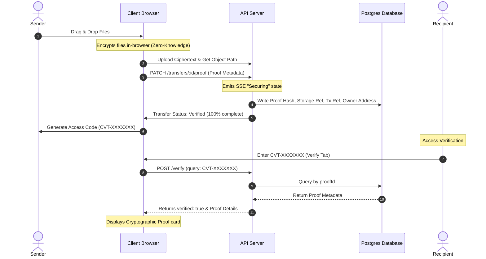

# Blockchain Integration & Cryptographic Proofs

This document explains what blockchain technology is and how it is integrated into the **ChainVaultShare** application to secure file transfers and guarantee data integrity.

---

## 1. What is Blockchain? (Brief Overview)

A **blockchain** is a decentralized, distributed, and public digital ledger that is used to record transactions across many computers. Once recorded, the data in any given block cannot be altered retroactively without altering all subsequent blocks, which requires the consensus of the network.

Key properties of blockchain technology include:
*   **Immutability**: Once a block is added to the ledger, it cannot be edited, replaced, or deleted.
*   **Cryptographic Hashing**: Data is represented by secure cryptographic hashes (like SHA-256). Any minor change in the input data produces an entirely different hash.
*   **Trustless Verification**: Anyone can inspect the ledger to verify the authenticity, creator, and timestamp of a transaction without relying on a central authority.

---

## 2. How Blockchain is Used in ChainVaultShare

Storing large files directly on a blockchain is prohibitively expensive and public. Instead, ChainVaultShare implements a hybrid architecture: **decentralized/private file storage combined with blockchain-anchored cryptographic proofs**.

When you share files on ChainVaultShare:
1.  **Your files are stored privately** (and encrypted in-browser if using Zero-Knowledge Mode).
2.  **A cryptographic fingerprint of the transfer** is registered on the ledger as a permanent proof of existence.

### The Anchored Metadata
Each transfer has the following cryptographic proof columns registered in the system:

| Column Name | Description | Example / Format |
| :--- | :--- | :--- |
| **Proof Hash** (`proof_hash`) | A SHA-256 fingerprint representing the exact content and ordering of the uploaded files. | `0x71C7656EC7ab88b098defB751B740...` |
| **Storage Reference** (`storage_ref`) | A pointer to where the files are stored in a content-addressed storage system (like IPFS). | `ipfs://QmXoypizjW3WknFiJnKLwHC...` |
| **Transaction Ref** (`tx_ref`) | The transaction ID representing the ledger entry that anchored the proof. | `0x9c3d4aef81e263d917...` |
| **Owner Address** (`owner_address`) | The Ethereum public wallet address of the user who signed and created the transfer. | `0x71C7656EC7ab88b098defB751B740...` |
| **Network Name** (`network_name`) | The specific blockchain ledger where the proof transaction resides. | `Ethereum Mainnet` |
| **Verified At** (`verified_at`) | The timestamp when the block was validated and finalized. | `2026-07-08T17:31:24.000Z` |

---

## 3. Step-by-Step Flow of a Secure Transfer

### Step 1: Hashing & Encryption (Client-side)
Before files leave your device, the browser calculates the cryptographic hash. If Zero-Knowledge mode is active, the files are encrypted locally with AES-GCM-256. The server receives only the ciphertext, making it blind to your actual data.

### Step 2: Anchoring (The "Securing" Phase)
During the upload process, the transfer moves into a `"securing"` state. The application registers the cryptographic proof (`proofHash`), transaction reference (`txRef`), storage pointer (`storageRef`), and creator's public wallet key (`ownerAddress`) as metadata.

### Step 3: Recipient Verification
When a recipient uses the **Verify** tab:
*   They input either the CVT access code or the share link.
*   The application fetches the registered blockchain proof metadata.
*   The client matches and renders the **Proof Hash**, proving that the downloaded files correspond *exactly* to the original transaction fingerprint recorded on the network.

---

## 4. Local Development Implementation

For this local project, the blockchain transaction anchors are simulated and stored in the PostgreSQL database using **Drizzle ORM** (mapped in [transfersTable](file:///c:/Users/cyanide/Downloads/chainvault-raw/lib/db/src/schema/transfers.ts)). This architecture models real-world enterprise protocols (like OpenAttestation or OriginTrail) where file metadata is written to ledger state, while keeping the local build lightweight, fast, and gas-free.
